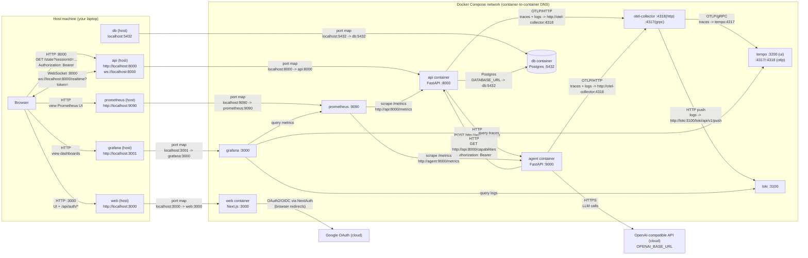

# trainer2

Phase 0 (walking skeleton): Docker Compose brings up Postgres + FastAPI + Next.js + an agent placeholder.

## Run

- `docker compose up --build`

## Database migrations (Alembic)

The API uses Alembic for schema migrations.

On `docker compose up`, the API container automatically runs `alembic upgrade head` before starting.

- Apply migrations: `docker compose run --rm api alembic upgrade head`
- Create a new migration (after model changes): `docker compose run --rm api alembic revision -m "..." --autogenerate`

For a destructive reset (wipe DB volume + re-migrate), see [.dev/scripts/README.md](.dev/scripts/README.md).

## Chat (how it works)

The web app connects to the API websocket (`/realtime`). When you send a chat message:

- Browser (Next.js) -> API websocket `/realtime`
- API -> agent service `POST /run`
- Agent -> OpenAI-compatible API (via OpenAI Agents SDK)

To run chat, set these in `.env` (see `.env.example`):

- `OPENAI_API_KEY`
- `OPENAI_MODEL`
- Optional: `OPENAI_BASE_URL` (defaults to `https://api.openai.com/v1`)

## System connections (diagram)

## Agent / API split (prompts vs tools)

This repo intentionally keeps a clean boundary:

- Agent service owns *agentic content*: prompts + skills under [services/agent/app/instructions](services/agent/app/instructions).
- API service owns *tool implementations* (DB writes, profile CRUD, etc.).
- The API publishes a signed capabilities surface (`GET /capabilities`) containing tool schemas + table cards.
- The agent periodically syncs that surface and explodes it into auditable files under [services/agent/app/generated](services/agent/app/generated).

### Capabilities auth (key pair)

The agent authenticates to the API using an RS256-signed JWT:

- API env: `AGENT_PUBLIC_KEY`
- Agent env: `AGENT_PRIVATE_KEY`

Generate a dev keypair (one-time):

- `openssl genpkey -algorithm RSA -pkeyopt rsa_keygen_bits:2048 -out agent_private.pem`
- `openssl rsa -pubout -in agent_private.pem -out agent_public.pem`

Then set:

- `AGENT_PRIVATE_KEY` to the contents of `agent_private.pem`
- `AGENT_PUBLIC_KEY` to the contents of `agent_public.pem`

Trigger a manual sync (optional; agent also syncs on startup when configured):

- `curl -X POST http://localhost:9000/update`

## Shortcuts

- `make help`
- `make build`
- `make check`

## Template versioning

- This repo is intended to be taggable as a template release.
- See `git-cheatsheet.md` for the exact commands (e.g. tagging the current commit as `template1`).

## Endpoints

- Web: http://localhost:3000
- API health: http://localhost:8000/health
- API websocket echo: ws://localhost:8000/realtime
- Agent health: http://localhost:9000/health

## Observability

- Grafana: http://localhost:3001 (admin/admin)
- Prometheus: http://localhost:9090
- Loki: http://localhost:3100
- Tempo: http://localhost:3200

Metrics:

- API metrics: http://localhost:8000/metrics
- Agent metrics: http://localhost:9000/metrics
