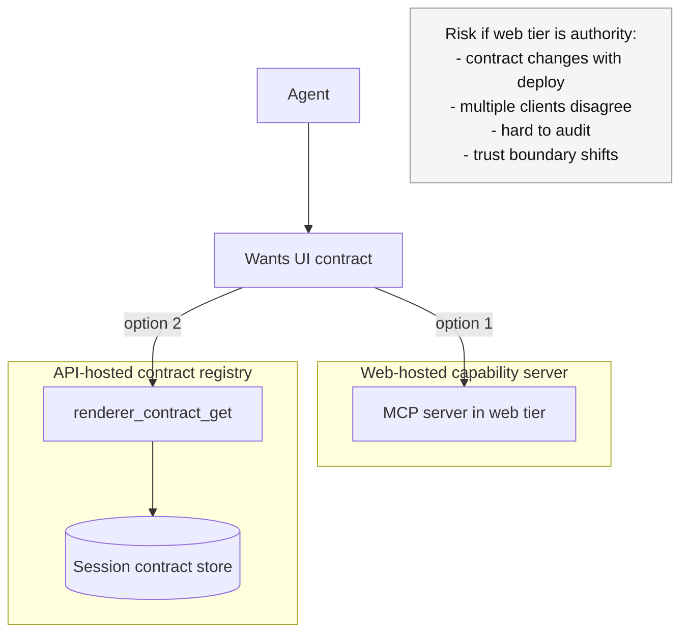
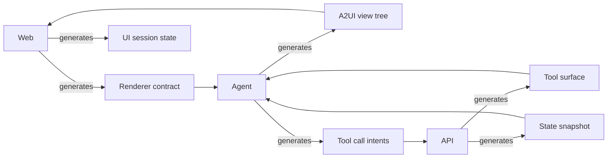

# trainer2 — A2UI Contract On-Demand (Diagrams)

This doc diagrams the architecture you described:
- a **tree structure on both sides** of the agent
  - backend: tool + domain state tree
  - frontend: renderable component tree
- both trees are **generated on the fly**
- the **UI contract is fetched only when asked for** (not injected every run)

---

## 1) Two different “trees” (don’t conflate them)

```mermaid
flowchart LR

subgraph Backend[Backend side]
  State[(State tree
(event-sourced + SQL snapshot))]
  Tools[(Tool surface tree
/capabilities tools + schemas)]
end

subgraph Agent[Agent]
  Reason[Reasoning / planning]
end

subgraph Frontend[Frontend side]
  View[(View tree
A2UI JSON)]
  UI[Renderer
(React components)]
end

State --> Agent
Tools --> Agent
Agent --> View
View --> UI
```

Notes:
- **Tools tree** is about *capabilities to cause effects* (executed by backend).
- **View tree** is about *what to render* (executed by the UI renderer).

---

## 2) Capability surfaces are different (tooling vs UI)

```mermaid
flowchart TD

API[API] -->|publishes| ToolCaps[Tool Capabilities
(/capabilities tools + table cards)]

Web[Web renderer] -->|has| UICaps[UI Capabilities
(component subset + props + schema version)]

ToolCaps --> Agent
UICaps --> Agent

note1[Important:
Tool capabilities are security-bound
and belong to the backend.
UI capabilities are renderer-bound
and belong to the client.]:::note

classDef note fill:#f5f5f5,stroke:#999,color:#111;
```

---

## 3) “On-demand” contract fetch (only when asked)

Key property: the agent does **not** receive the UI contract by default.
It learns:
- A2UI exists
- how to request the UI contract
- how to behave if the contract is missing

```mermaid
sequenceDiagram
  autonumber
  participant Browser
  participant API
  participant Agent

  Browser->>API: WS connect + auth
  Note over Browser,API: Browser may send renderer metadata once
  Browser->>API: (optional) renderer.hello {name, version}

  Browser->>API: chat.send "Help me set up onboarding"
  API->>Agent: POST /run (base prompt only; no UI contract)

  alt Agent decides UI is NOT needed
    Agent-->>API: stream text events
    API-->>Browser: chat.message (text)
  else Agent decides UI IS needed
    Note over Agent: Agent requests contract only now
    Agent->>API: tool call: renderer_contract_get()
    API-->>Agent: returns {schemaVersion, allowedComponents, propRules}
    Agent-->>API: emits A2UI JSON (view tree)
    API-->>Browser: a2ui.render {view}
  end

  Browser->>API: a2ui.action {action,...}
  API->>Agent: POST /run with user action
  Agent-->>API: updated view or text
  API-->>Browser: a2ui.render or text
```

This achieves:
- **no per-turn prompt bloat**
- agent still can produce UI when appropriate

---

## 4) Where the UI contract “lives” if you sell the agent without the site

If you sell the agent separately, the UI contract cannot be tied to “your Next.js app”.
It must be **session/client-provided**.

```mermaid
flowchart LR

subgraph Clients[Different clients]
  A[Client A
(React subset)]
  B[Client B
(Mobile wrapper)]
  C[Client C
(Text-only)]
end

subgraph API[API (contract registry)]
  Store[(Session contract store
threadId -> renderer contract)]
end

subgraph Agent[Agent service]
  Run[/run]
  Get[renderer_contract_get]
end

A -->|register contract| Store
B -->|register contract| Store
C -->|register none| Store

Run --> Get
Get --> Store
```

Interpretation:
- Clients register **their** contract (or none).
- The agent fetches the contract only when it needs UI.
- Text-only clients simply never provide a contract.

---

## 5) Why “frontend MCP serves A2UI surface” is usually the wrong boundary



Summary:
- If the agent is a product, the authority for “what UI contract applies” should be **backend/session**, not “whatever web server is present”.

---

## 6) What “generate the tree on the fly” means (practically)

You said: “I want this tree structure on both sides… each side generates it on the fly.”
That typically maps to:

- **Frontend generates**:
  - a “renderer contract” (supported components/props + schema version)
  - per-session UI state (what’s on screen)

- **Backend generates**:
  - tool surface (from `/capabilities`)
  - state snapshot (event log + SQL profile)

- **Agent generates**:
  - A2UI view tree (only when it decides UI is appropriate)
  - tool calls (only when it needs backend side effects)



---

## 7) Minimal “base prompt documentation” (conceptual)

Even with on-demand loading, the base prompt must include at least:
- that A2UI exists
- how to request the renderer contract
- what to do if no contract is available

Everything else (full schema, full component catalog) is fetched only when needed.
