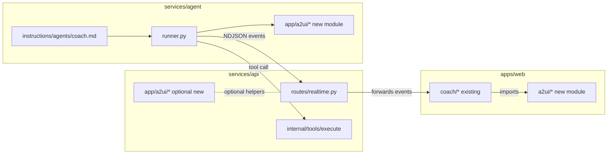
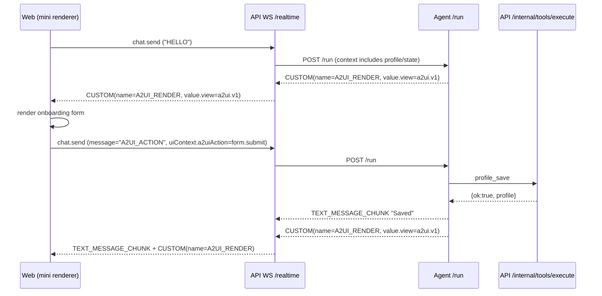

# A2UI v1 + Mini Renderer + Profile Onboarding Form — Implementation Plan (trainer2)

**Goal:** Implement a *real* A2UI loop (proper schema, deterministic mini renderer, end-to-end event wiring) and use it for a concrete workflow: **coach-driven onboarding form for the `profiles` table**.

This is written as a step-by-step plan with **exact files to change** and **code snippets**.

## Development isolation (keep main views minimal)

Yes — we can do almost all of this work “in its own place” and keep changes to existing screens very small.

### Folder boundaries (target)

- Web-only A2UI code lives in: `apps/web/app/a2ui/`
  - Schema + runtime validation
  - Renderer
  - A2UI client helpers (send action, parse view)
- Agent-side A2UI emission/parsing lives in: `services/agent/app/a2ui/`
  - A2UI fenced block extraction
  - Event emission helpers
- API-side forwarding lives in: `services/api/app/a2ui/`
  - Optional: event helpers / types

We keep “touch points” to existing code limited to:

- `apps/web/app/coach/useCoachChat.ts`: add support for receiving a view + sending an action
- `apps/web/app/coach/CoachClient.tsx`: render the A2UI panel beneath chat
- `services/agent/app/runner.py`: emit an A2UI render event
- `services/api/app/routes/realtime.py`: forward A2UI render events

Everything else is additive.



---

## 0) Success definition (what “done” means)

1) The agent can emit an **A2UI view tree** (JSON) that conforms to a versioned schema (`a2ui.v1`).
2) The API forwards that view tree over the existing WebSocket (`/realtime`) using a typed event.
3) The web app renders the tree deterministically using a **mini renderer** (small component subset).
4) When the user submits the onboarding form, the UI sends a **typed action event** back to the agent (via the API WS).
5) The agent calls `profile_save({ profile })` exactly once on submit.
6) The UI updates (form closes or shows “saved”) based on the agent’s next emitted view.

Non-goals for v1:
- No “full React renderer” for arbitrary schemas.
- No per-keystroke tool calls.
- No new pages or complex UI layouts.

Isolation constraint:
- No refactor of existing chat components; A2UI is a single embedded panel.

---

## 1) Choose the minimal A2UI v1 subset (schema)

We want *real schema*, but a **small** node set.

### 1.1 View envelope

```ts
export type A2uiViewV1 = {
  kind: "a2ui.v1";
  viewId: string;
  title?: string;
  root: A2uiNodeV1;
};
```

### 1.2 Node types (v1)

- `screen`: root container
- `section`: titled group
- `text`: plain text
- `form`: fields + submit
- `field.text`
- `field.number`

```ts
export type A2uiNodeV1 =
  | { type: "screen"; children: A2uiNodeV1[] }
  | { type: "section"; title?: string; children: A2uiNodeV1[] }
  | { type: "text"; text: string }
  | {
      type: "form";
      id: string;
      fields: A2uiFieldV1[];
      submitLabel?: string;
    };

export type A2uiFieldV1 =
  | { type: "field.text"; name: string; label: string; required?: boolean; value?: string }
  | { type: "field.number"; name: string; label: string; required?: boolean; value?: number };
```

### 1.3 Action types (UI → agent)

We need only one action for onboarding:

```ts
export type A2uiActionV1 = {
  kind: "a2ui.action.v1";
  viewId: string;
  action: {
    type: "form.submit";
    formId: string;
    values: Record<string, unknown>;
  };
};
```

### 1.4 Runtime validation

TypeScript types are not enough. Pick one:

Option A (recommended): add `zod` and validate at runtime.
- Pros: ergonomic, fast to write, great error messages.
- Cons: adds dependency.

Option B: add `ajv` and validate JSON Schema.
- Pros: “proper JSON Schema”.
- Cons: more boilerplate.

This plan uses **Zod**.

---

## 2) Add shared A2UI schema + validator to the web app

### 2.1 Files to add

Create:
- `apps/web/app/a2ui/schema.ts` — Zod schemas + TS types
- `apps/web/app/a2ui/render.tsx` — mini renderer component
- `apps/web/app/a2ui/client.ts` — helper to build/send A2UI actions (optional, but keeps `useCoachChat.ts` small)

### 2.2 Zod schema (example)

File: `apps/web/app/a2ui/schema.ts`

```ts
import { z } from "zod";

const FieldText = z.object({
  type: z.literal("field.text"),
  name: z.string().min(1),
  label: z.string().min(1),
  required: z.boolean().optional(),
  value: z.string().optional(),
});

const FieldNumber = z.object({
  type: z.literal("field.number"),
  name: z.string().min(1),
  label: z.string().min(1),
  required: z.boolean().optional(),
  value: z.number().optional(),
});

export const A2uiFieldV1Schema = z.union([FieldText, FieldNumber]);

export const A2uiNodeV1Schema: z.ZodType<any> = z.lazy(() =>
  z.union([
    z.object({ type: z.literal("screen"), children: z.array(A2uiNodeV1Schema) }),
    z.object({ type: z.literal("section"), title: z.string().optional(), children: z.array(A2uiNodeV1Schema) }),
    z.object({ type: z.literal("text"), text: z.string() }),
    z.object({
      type: z.literal("form"),
      id: z.string().min(1),
      fields: z.array(A2uiFieldV1Schema),
      submitLabel: z.string().optional(),
    }),
  ])
);

export const A2uiViewV1Schema = z.object({
  kind: z.literal("a2ui.v1"),
  viewId: z.string().min(1),
  title: z.string().optional(),
  root: A2uiNodeV1Schema,
});

export type A2uiViewV1 = z.infer<typeof A2uiViewV1Schema>;

export const A2uiActionV1Schema = z.object({
  kind: z.literal("a2ui.action.v1"),
  viewId: z.string().min(1),
  action: z.object({
    type: z.literal("form.submit"),
    formId: z.string().min(1),
    values: z.record(z.unknown()),
  }),
});

export type A2uiActionV1 = z.infer<typeof A2uiActionV1Schema>;
```

Dependency:

```bash
cd apps/web
npm install zod
```

---

## 3) Implement the mini renderer in the web app

### 3.1 Rendering approach

- Renderer is a pure function of the tree.
- No side effects.
- The only “output” is React elements.

### 3.2 File: `apps/web/app/a2ui/render.tsx` (sketch)

```tsx
"use client";

import { useMemo, useState } from "react";
import type { A2uiViewV1 } from "./schema";

type Props = {
  view: A2uiViewV1;
  onSubmitForm: (formId: string, values: Record<string, unknown>) => void;
};

export function A2uiRenderer({ view, onSubmitForm }: Props) {
  return (
    <div className="w-full rounded-2xl border border-zinc-900 bg-zinc-950 p-4">
      {view.title ? <div className="mb-3 text-lg font-semibold text-zinc-100">{view.title}</div> : null}
      <Node node={view.root} onSubmitForm={onSubmitForm} />
    </div>
  );
}

function Node({ node, onSubmitForm }: { node: any; onSubmitForm: Props["onSubmitForm"] }) {
  switch (node.type) {
    case "screen":
      return <div className="space-y-4">{node.children.map((c: any, i: number) => <Node key={i} node={c} onSubmitForm={onSubmitForm} />)}</div>;

    case "section":
      return (
        <section className="space-y-3">
          {node.title ? <div className="text-zinc-200 font-medium">{node.title}</div> : null}
          <div className="space-y-3">{node.children.map((c: any, i: number) => <Node key={i} node={c} onSubmitForm={onSubmitForm} />)}</div>
        </section>
      );

    case "text":
      return <p className="text-zinc-200 whitespace-pre-wrap">{node.text}</p>;

    case "form":
      return <FormNode node={node} onSubmitForm={onSubmitForm} />;

    default:
      return null;
  }
}

function FormNode({ node, onSubmitForm }: { node: any; onSubmitForm: Props["onSubmitForm"] }) {
  const initial = useMemo(() => {
    const values: Record<string, unknown> = {};
    for (const f of node.fields ?? []) {
      if (typeof f?.name === "string" && f.value !== undefined) values[f.name] = f.value;
    }
    return values;
  }, [node.fields]);

  const [values, setValues] = useState<Record<string, unknown>>(initial);

  return (
    <form
      className="space-y-3"
      onSubmit={(e) => {
        e.preventDefault();
        onSubmitForm(node.id, values);
      }}
    >
      {(node.fields ?? []).map((f: any) => {
        if (f.type === "field.text") {
          return (
            <label key={f.name} className="block">
              <div className="mb-1 text-sm text-zinc-300">{f.label}</div>
              <input
                className="w-full rounded-xl border border-zinc-800 bg-black px-3 py-2 text-zinc-100"
                value={String(values[f.name] ?? "")}
                onChange={(e) => setValues((prev) => ({ ...prev, [f.name]: e.target.value }))}
              />
            </label>
          );
        }

        if (f.type === "field.number") {
          return (
            <label key={f.name} className="block">
              <div className="mb-1 text-sm text-zinc-300">{f.label}</div>
              <input
                type="number"
                className="w-full rounded-xl border border-zinc-800 bg-black px-3 py-2 text-zinc-100"
                value={values[f.name] === undefined ? "" : String(values[f.name])}
                onChange={(e) => {
                  const raw = e.target.value;
                  const num = raw === "" ? undefined : Number(raw);
                  setValues((prev) => ({ ...prev, [f.name]: Number.isFinite(num) ? num : undefined }));
                }}
              />
            </label>
          );
        }

        return null;
      })}

      <button
        type="submit"
        className="rounded-xl bg-zinc-100 px-4 py-2 text-sm font-semibold text-black"
      >
        {node.submitLabel ?? "Save"}
      </button>
    </form>
  );
}
```

---

## 4) Wire A2UI render events through the existing WS protocol

You already have support in the web type union for:
- `ASSISTANT_DRAFT_PROPOSED` with `draftA2ui?: unknown`
- `ASSISTANT_FINAL_APPROVED` with `finalA2ui?: unknown`

But the API currently does **not** populate those.

### 4.1 Minimize changes to existing WS typings (recommended)

To keep the web “main views” changes minimal, reuse the existing `CUSTOM` server event variant in:
- `apps/web/app/coach/wsProtocol.ts` (already includes `CUSTOM`)

We can represent A2UI renders as:

```json
{ "type": "CUSTOM", "name": "A2UI_RENDER", "value": { "view": { /* a2ui.v1 */ } } }
```

Pros:
- No need to add a new union member in the web protocol type.
- Still explicit and machine-readable.

Alternative:
- Introduce a first-class `type: "A2UI_RENDER"` event in both backend and frontend typings.
- Slightly “cleaner”, but touches more files.

### 4.2 Backend contract (NDJSON agent → API)

Add a new agent stream event type (explicit):

```json
{ "type": "A2UI_RENDER", "view": { /* a2ui.v1 */ } }
```

Or, minimal: just add `a2ui` onto the final assistant event(s).

This plan does both:
- forward `A2UI_RENDER` for immediate UI updates
- also include `draftA2ui`/`finalA2ui` in audit-mode approval events

---

## 5) Teach the agent to emit A2UI JSON (and parse it server-side)

### 5.1 Output format rule

Update coach instructions so that when it wants to show UI, it emits exactly one fenced block:

```text
Here’s the onboarding form.

```a2ui
{ ... }
```
```

### 5.2 Parse rule in the agent service

Modify `services/agent/app/runner.py`:
- After `final_text = streamed.final_output_as(str)`
- Extract the fenced `a2ui` JSON block
- Remove it from the visible assistant text
- Emit an A2UI render event containing the parsed view

To keep this isolated, add a new helper module:
- `services/agent/app/a2ui/extract.py`

Then `runner.py` just imports and calls it.

Parser sketch:

```py
import re

_A2UI_BLOCK = re.compile(r"```a2ui\s*(\{.*?\})\s*```", re.DOTALL)

def extract_a2ui(text: str) -> tuple[str, dict | None]:
    m = _A2UI_BLOCK.search(text or "")
    if not m:
        return (text, None)
    raw_json = m.group(1)
    try:
        obj = json.loads(raw_json)
    except Exception:
        obj = None

    stripped = (text[: m.start()] + text[m.end() :]).strip()
    return stripped, obj if isinstance(obj, dict) else None
```

Emit (two options):

Option A (minimal client touching): emit `CUSTOM` so the web protocol doesn’t need updating.

```py
if a2ui is not None:
  yield {"type": "CUSTOM", "name": "A2UI_RENDER", "value": {"view": a2ui} }
```

Option B (first-class): emit `A2UI_RENDER`.

```py
stripped_text, a2ui = extract_a2ui(final_text)
if a2ui is not None:
  yield {"type": "CUSTOM", "name": "A2UI_RENDER", "value": {"view": a2ui} }
final_text = stripped_text
```

---

## 6) Forward A2UI_RENDER from API to browser

Modify `services/api/app/routes/realtime.py` in the event loop:

- Today it forwards:
  - `TOOL_CALL_*`
  - `TEXT_MESSAGE_CHUNK`

Add forwarding for A2UI renders.

If you chose the `CUSTOM` approach, forward `CUSTOM` events *only when* `name == "A2UI_RENDER"`.

Add (CUSTOM approach):

```py
if etype == "CUSTOM" and evt.get("name") == "A2UI_RENDER":
  out = dict(evt)
  out["threadId"] = thread_id
  out["runId"] = run_id
  await safe_send(out)
  continue
```

And in audit mode:
- include `draftA2ui` in `ASSISTANT_DRAFT_PROPOSED`
- include `finalA2ui` in `ASSISTANT_FINAL_APPROVED`

---

## 7) Web: store and render the latest A2UI view

Modify `apps/web/app/coach/useCoachChat.ts`:

- Add state:

```ts
const [a2uiView, setA2uiView] = useState<unknown>(null);
```

- Handle server event:

```ts
if (evt.type === "CUSTOM" && evt.name === "A2UI_RENDER") {
  const value = evt.value as any;
  setA2uiView(value?.view ?? null);
  return;
}
```

- Render below chat messages in `apps/web/app/coach/CoachClient.tsx`:

```tsx
{a2uiView ? (
  <A2uiRenderer view={validatedView} onSubmitForm={...} />
) : null}
```

Validation step:

```ts
const parsed = A2uiViewV1Schema.safeParse(a2uiView);
const validatedView = parsed.success ? parsed.data : null;
```

---

## 8) Send A2UI actions back to the agent (form submit)

### 8.1 Keep the existing websocket envelope

We won’t change `services/api/app/protocol.py`.
We’ll send a normal run message with a special payload in `forwardedProps.uiContext`.

To keep this isolated, we treat A2UI actions as a *single* “submit event” from the UI and do not modify chat history rendering.

In `apps/web/app/coach/useCoachChat.ts`, implement:

```ts
function sendA2uiAction(action: A2uiActionV1) {
  const ws = wsRef.current;
  if (!ws || ws.readyState !== WebSocket.OPEN) return;

  const payload: ClientRunEnvelope = {
    threadId: threadIdRef.current || threadId || newRequestId(),
    runId: newRequestId(),
    message: "A2UI_ACTION",
    forwardedProps: {
      uiContext: {
        a2uiAction: action,
      },
    },
  };

  ws.send(JSON.stringify(payload));
}
```

### 8.2 API already forwards `uiContext` into agent context

`services/api/app/routes/realtime.py` builds:

```py
context_payload = {"ui": ui_context or {}, "state": snapshot}
```

So the agent will see:

```json
{ "ui": { "a2uiAction": { ... } }, "state": { ... } }
```

---

## 9) Coach behavior: profile onboarding form (real workflow)

### 9.1 The form schema (fields)

Profile fields today:
- firstName, lastName, email, phone
- goals, experience, constraints, equipment, injuriesOrRiskFlags, dietPrefs
- metrics.age, metrics.height, metrics.weight

The onboarding A2UI form should include a minimal subset first:
- firstName
- lastName
- goals
- experience

(Then expand later.)

### 9.2 Coach instruction changes

Modify `services/agent/app/instructions/agents/coach.md`:

Add rules:
- Always call `profile_get({})` at start (already there).
- If profile is missing or mostly empty:
  - emit an A2UI `a2ui.v1` view containing a `form` node
  - set `form.id = "profile_onboarding"`
- If the user message is `A2UI_ACTION` and context.ui.a2uiAction is present:
  - read submitted values
  - call `profile_save({ profile: values })`
  - then emit a “saved” view or a toast-like message in UI text

### 9.3 Example A2UI view (onboarding)

```json
{
  "kind": "a2ui.v1",
  "viewId": "profile_onboarding_v1",
  "title": "New member onboarding",
  "root": {
    "type": "screen",
    "children": [
      {"type": "text", "text": "Tell me a bit about you. You can edit before saving."},
      {
        "type": "form",
        "id": "profile_onboarding",
        "submitLabel": "Save profile",
        "fields": [
          {"type": "field.text", "name": "firstName", "label": "First name", "required": true},
          {"type": "field.text", "name": "lastName", "label": "Last name"},
          {"type": "field.text", "name": "goals", "label": "Goals"},
          {"type": "field.text", "name": "experience", "label": "Experience"}
        ]
      }
    ]
  }
}
```

On submit:
- UI sends `A2UI_ACTION` with action `form.submit` and values.
- Coach calls `profile_save({ profile: values })`.

---

## 10) End-to-end flow diagram



---

## 11) Validation checklist (manual)

1) Login, open `/coach`.
2) Send `HELLO`.
3) See onboarding form render.
4) Submit form.
5) Observe `TOOL_CALL_STARTED profile_save` and `TOOL_CALL_RESULT`.
6) Send `HELLO` again.
7) Coach should see existing profile and not re-onboard.

---

## 12) Implementation order (do it in this order)

1) Web: create `apps/web/app/a2ui/*` (schema + renderer) with no changes elsewhere.
2) Agent: add A2UI fenced block emission in `services/agent/app/instructions/agents/coach.md`.
3) Agent: add `services/agent/app/a2ui/extract.py`, then update `runner.py` to emit `CUSTOM(name=A2UI_RENDER, value.view=...)`.
4) API: update `services/api/app/routes/realtime.py` to forward only that custom A2UI render event.
5) Web: minimal touchpoints:
  - `apps/web/app/coach/useCoachChat.ts` handle the `CUSTOM` event and store `a2uiView`
  - `apps/web/app/coach/CoachClient.tsx` render the A2UI panel beneath chat
6) Web: implement `sendA2uiAction` on submit (no other chat component changes).
7) Agent: handle `A2UI_ACTION` and call `profile_save`.

---

## 13) Notes / gotchas

- The agent currently streams text chunks; A2UI is best sent as a single structured event.
- Keep the UI deterministic: do not let the agent “patch” UI by tool calls.
- Keep writes coarse: `profile_save` only on submit.
- If audit mode is enabled later for profile writes, the same tool-approval boundary applies automatically.

Minimal-change warning:
- Avoid touching `apps/web/app/components/*` for v1. If you need styling, do it inside the A2UI module.
