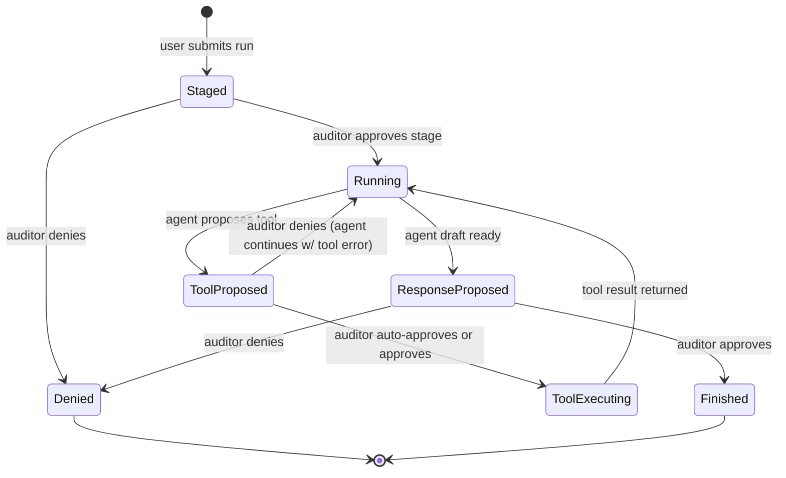

# /coach_audit — Human-in-the-Loop Coach Console (Spec)

This is a **design/spec doc** only (no code changes). It describes a second UI route `/coach_audit` that:
- shows the normal coach chat
- adds an **auditor panel** that can:
  - approve/deny the **context** before a run is sent to the agent
  - approve/deny/edit **tool calls** (human-in-the-loop)
  - approve/deny/edit the **assistant response** before it is persisted/shown
  - auto-approve certain tool calls based on rules

---

## 1) Goals

- Make agent behavior **inspectable and controllable** while you iterate on:
  - prompt modularity
  - new tables + tools (weights now, more later)
  - A2UI/form workflows
- Provide a “second set of eyes” interface that can:
  - see **full context** at each step
  - approve/deny, or edit inputs/outputs
  - implement **guardrails** by policy (auto-approve safe tools)

## 2) Non-goals

- Not a full admin/auth product.
- Not a replacement for observability (Tempo/Grafana). This is **interactive control**, not just logs.
- Not a full A2UI renderer spec (but should be compatible with A2UI events later).

---

## 3) UX: What `/coach_audit` looks like

Layout (one page):
- Left: **chat thread** (same as `/coach`)
- Right: **audit console**

Audit console sections:
1) **Run staging**
   - Shows the exact payload about to be sent:
     - user message
     - server state snapshot
     - UI contract (if included)
     - any “loaded skills/cards” (if used)
   - Buttons:
     - Approve + Send
     - Edit payload + Send
     - Deny (do not send)

2) **Event timeline** (streaming)
   - RUN_STARTED
   - TOOL_CALL_PROPOSED (new)
   - TOOL_CALL_APPROVED / TOOL_CALL_DENIED (new)
   - TOOL_CALL_STARTED / TOOL_CALL_RESULT
   - ASSISTANT_DRAFT_PROPOSED (new)
   - ASSISTANT_FINAL_APPROVED / DENIED (new)
   - RUN_FINISHED

3) **Policies (auto-approve)**
   - Rule list (editable, persisted locally at first):
     - Auto-approve: `profile_get`, `weight_entry_list`
     - Require approval: any `*_delete`, any `*_save_batch`, any cross-table writes
     - Hard deny: unknown tools

4) **Diff/patch helper** (optional but high value)
   - When a tool call proposes `args`, show:
     - the args JSON
     - a suggested “patch” UI (edit fields) before approval

---

## 4) Architectural principle

- The **API remains the authority**:
  - tools execute server-side only
  - approval decisions happen in a trusted context (API or admin UI authenticated against API)
- `/coach_audit` is just a UI for **approving a state machine**.

---

## 5) Where to intercept (three gates)

### Gate A — Before calling the agent (context approval)

Current flow (today):
- Web → WS `/realtime` → API builds context snapshot → API calls agent `/run`

Audit flow:
- Web `/coach_audit` sends a run request
- API **does not call the agent immediately**
- API emits `RUN_STAGED` with the would-be payload
- Auditor must approve (or edit) to continue

### Gate B — Before executing a tool call (tool approval)

Current flow (today):
- Agent calls tools via API internal tool endpoint

Audit flow:
- Agent proposes tool call
- API emits `TOOL_CALL_PROPOSED`
- Auditor approves/denies/edits args
- Only then is the tool executed

### Gate C — Before finalizing assistant output (response approval)

Audit flow:
- Agent produces assistant draft
- API emits `ASSISTANT_DRAFT_PROPOSED`
- Auditor approves/edits/denies
- API persists + forwards the final message

---

## 6) Message types (WS) — conceptual

These are suggested message types for the `/realtime` WS stream.

### 6.1 Staging
- `RUN_STAGED`
  - `{ threadId, runId, payload: { message, context, ... } }`

- `RUN_STAGE_APPROVED`
  - `{ threadId, runId, payloadEdits? }`

- `RUN_STAGE_DENIED`
  - `{ threadId, runId, reason? }`

### 6.2 Tool approvals
- `TOOL_CALL_PROPOSED`
  - `{ threadId, runId, toolCallId, toolName, args, label }`

- `TOOL_CALL_APPROVED`
  - `{ threadId, runId, toolCallId, argsOverride? }`

- `TOOL_CALL_DENIED`
  - `{ threadId, runId, toolCallId, reason? }`

### 6.3 Response approval
- `ASSISTANT_DRAFT_PROPOSED`
  - `{ threadId, runId, draftText, draftA2ui? }`

- `ASSISTANT_FINAL_APPROVED`
  - `{ threadId, runId, finalText, finalA2ui? }`

- `ASSISTANT_FINAL_DENIED`
  - `{ threadId, runId, reason? }`

---

## 7) State machine (high level)

---

## 8) Implementation outline (still no code)

### 8.1 Web
- Add route `/coach_audit`.
- Reuse the existing chat hook, but:
  - render the audit panel
  - render the WS event timeline
  - send “approve/deny/edit” messages back over WS
- Store auto-approve rules:
  - MVP: `localStorage`
  - checkboxes per gate type?
  - checkboxes per tool?
  - later: persisted server-side per user

### 8.2 API
- Add a second WS “mode”:
  - normal chat mode
  - audit mode
- Persist audit sessions keyed by `{threadId, runId}`.
- Add a lightweight “approval coordinator”:
  - blocks forward progress until approval arrives
  - enforces timeouts (optional)

### 8.3 Agent
- Ideally unchanged, but the agent runner must surface enough structure for:
  - tool-call proposals
  - assistant draft proposal

---

## 9) Auto-approval policy examples

Rules can be simple:
- Auto-approve reads:
  - `profile_get`
  - `weight_entry_list`
- Require approval:
  - `*_save_batch` (bulk write)
  - `*_delete`
  - anything that modifies more than N rows
- Deny unknown tools

Important: the policy engine should live server-side eventually, even if the UI lets you edit it.

---

## 10) “Is there already a good interface for this?”

There are two categories:

### 10.1 Observability / replay UIs (great, but not approval control)
Look for:
- **LLM tracing & sessions** (view prompts, tool calls, latencies)
- **OpenTelemetry trace viewers**

Search terms:
- “LLM tracing UI”
- “agent observability platform”
- “OpenTelemetry LLM traces”

Examples (commonly used in the ecosystem):
- Langfuse
- LangSmith
- Helicone

These excel at: “show me every step”
They do *not* usually handle: “approve/deny tool call before execution”

### 10.2 Human-in-the-loop / approval products
Search terms:
- “human in the loop agent tool approval”
- “approval workflow for AI tool calls”
- “AI agent safety review console”

In practice, many teams build this in-app because the approval logic is domain-specific.
