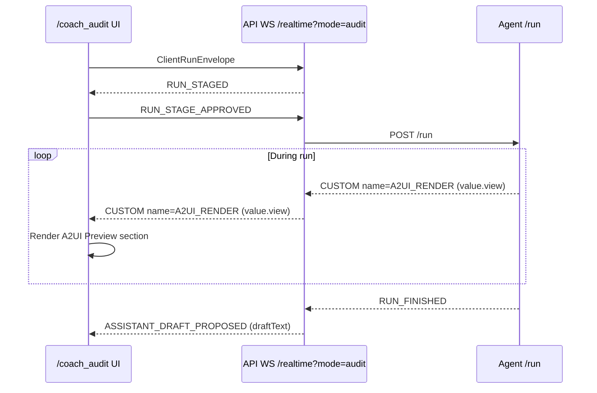
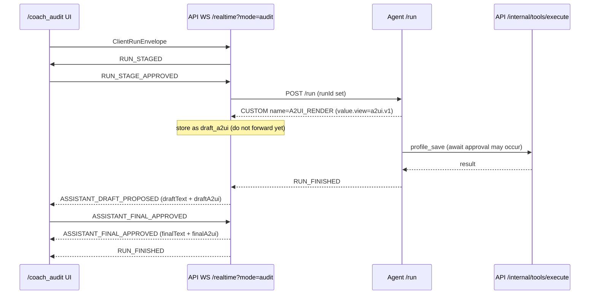
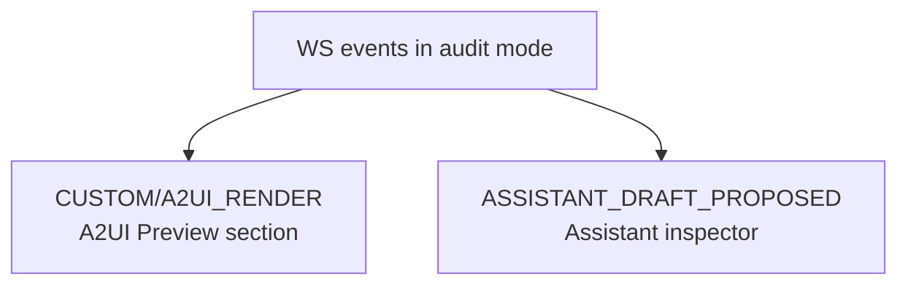

# `services/agent/app/runner.py` — A2UI extraction + render-event emission (design notes)

This document **does not change code**. It describes the potential changes to implement:

- Extract a fenced ` ```a2ui ... ``` ` JSON block from the agent’s final output
- Remove that JSON block from the visible assistant text
- Emit an **A2UI render event** as part of the NDJSON event stream
- Keep work isolated via a helper module: `services/agent/app/a2ui/extract.py`

It also answers:
- Where the “begin/end A2UI schema markers” live
- How to surface A2UI in **audit mode** with minimal changes outside the module

---

## 1) Where is the “begin/end A2UI schema” spec?

- This is **not** currently defined in `services/agent/app/runner.py`.
- The “begin/end” behavior should be enforced in the **agent instructions**, e.g. `services/agent/app/instructions/agents/coach.md`.

The most reliable “begin/end” marker in this repo’s direction is:

```text
```a2ui
{ ...json... }
```
```

That fence is the begin/end.

Today:
- `coach.md` does not yet require the model to output a fenced `a2ui` block.
- The concept is documented in `.dev/userdocs/trainer2-runtime-flow.md` and in `.dev/userdocs/a2ui-mini-renderer-profile-onboarding-plan.md`.

---

## 2) The target behavior inside `runner.py`

### 2.1 Current relevant spot

In `runner.py`, near the end of `run_stream(...)`, we compute:

- `final_text = streamed.final_output_as(str) or ""`

Then we emit:

- `TEXT_MESSAGE_CHUNK` (single final chunk)
- `RUN_FINISHED`

### 2.2 Proposed new behavior

Right after the `final_text = ...` line:

1) Extract A2UI fenced JSON block (if present)
2) Emit an A2UI render event (if extraction succeeded)
3) Strip the fenced block from `final_text`
4) Emit `TEXT_MESSAGE_CHUNK` with the stripped text only

This makes the UI view a **structured side channel**, and keeps chat text clean.

---

## 3) Isolated helper module: `services/agent/app/a2ui/extract.py`

### 3.1 New module responsibility

- Parse a single fenced block named `a2ui`
- Return:
  - the assistant-visible text without the block
  - the parsed JSON object (dict) or `None`

### 3.2 Parser sketch (as provided)

```py
import json
import re

_A2UI_BLOCK = re.compile(r"```a2ui\s*(\{.*?\})\s*```", re.DOTALL)

def extract_a2ui(text: str) -> tuple[str, dict | None]:
    m = _A2UI_BLOCK.search(text or "")
    if not m:
        return (text, None)
    raw_json = m.group(1)
    try:
        obj = json.loads(raw_json)
    except Exception:
        obj = None

    stripped = (text[: m.start()] + text[m.end() :]).strip()
    return stripped, obj if isinstance(obj, dict) else None
```

### 3.3 Why this is a module (not inline)

- Keeps `runner.py` changes tiny.
- Lets us evolve parsing rules (multiple blocks, better errors, etc.) without “touching runner again”.

---

## 4) Emitting A2UI render events (min-change approach)

### 4.1 Why `CUSTOM` is the lowest-friction event

Your web WS protocol union already supports:

- `type: "CUSTOM"` with `{ name?: string; value?: unknown }`

So the minimal-change A2UI event is:

```json
{
  "type": "CUSTOM",
  "name": "A2UI_RENDER",
  "value": {
    "view": { "kind": "a2ui.v1", "viewId": "...", "root": {"type":"screen","children":[]} }
  }
}
```

This avoids adding a new top-level event type across API + web.

### 4.2 Proposed emission point (conceptual)

Inside `run_stream`, after extracting `a2ui_view`:

- If `a2ui_view` is not `None`, yield the `CUSTOM/A2UI_RENDER` event
- Then continue to yield the normal `TEXT_MESSAGE_CHUNK`

This is compatible with both:
- non-audit chat UI (`/coach`)
- audit UI (`/coach_audit`) **if the API forwards the custom events**

---

## 5) How audit mode can show A2UI (minimal changes outside module)

### 5.1 Current audit behavior (important)

In `services/api/app/routes/realtime.py`:

- In **non-audit mode**, the API forwards `TEXT_MESSAGE_CHUNK` to the browser as it arrives.
- In **audit mode**, the API *does not* forward `TEXT_MESSAGE_CHUNK`; it accumulates text into `draft_text` and emits:
  - `ASSISTANT_DRAFT_PROPOSED` (for human approval)
  - then `ASSISTANT_FINAL_APPROVED` after approval

Today those events carry text only.

Important nuance:
- In audit mode, the *connected browser client* is the auditor UI (`/coach_audit`).
- So forwarding A2UI renders during audit runs does not leak to a normal end-user client.

### 5.2 Two good ways to surface A2UI in audit mode

**Goal:** the auditor can see the proposed A2UI view, and optionally approve/deny it.

There are two approaches that both work; pick based on the UX you want.

#### Option A — Stream preview to the auditor (recommended)

1) Let the agent emit `CUSTOM/A2UI_RENDER` during the run.
2) In `realtime.py` when `is_audit_mode` is true:
  - forward `CUSTOM(name=A2UI_RENDER)` events immediately over the WS.
3) In the audit UI, show an **A2UI Preview** section that renders the most recent view.

Why this is better:
- Auditor sees UI updates as they happen (just like tool proposals).
- No need to wait until the assistant draft stage.

Tradeoff:
- This shows A2UI, but does not formally make A2UI a separate approval gate unless you add one.

#### Option B — Attach A2UI to the assistant draft/final payload

1) Let the agent emit `CUSTOM/A2UI_RENDER` during the run.
2) In `realtime.py` (audit mode): capture it as `draft_a2ui` (latest view wins).
3) When emitting `ASSISTANT_DRAFT_PROPOSED`, include `draftA2ui: draft_a2ui`.
4) When emitting `ASSISTANT_FINAL_APPROVED`, include `finalA2ui: final_view`.

Why this is good:
- The auditor approves “assistant output” and can see the A2UI as part of that output.

Tradeoff:
- Auditor won’t see the view until the end of the run.

Why both are minimal:
- Web protocol already supports `CUSTOM`, and already declares `draftA2ui`/`finalA2ui` fields.
- Audit UI already has an “inspect/approve” side panel.

### 5.3 Audit flow diagrams

#### Option A: streaming preview



#### Option B: attach to assistant payload



### 5.4 “Inspect the response” UX (A2UI section in the audit console)

Yes — and it can reuse the same A2UI renderer.

The audit console can show A2UI in two places:

1) **A2UI Preview**: streaming, driven by `CUSTOM(name=A2UI_RENDER)`.
2) **Assistant response inspector**: show `draftA2ui`/`finalA2ui` in a JSON inspector and/or render it.

Minimal UI impact:
- Add a new collapsible section in the audit sidebar.
- Inside it, either:
  - render the view with the A2UI renderer, or
  - show the raw JSON via `JsonExplorer` (zero renderer integration).



### 5.5 What changes outside the module are unavoidable (if you want the auditor to actually *see* it)

Even if we keep `runner.py` isolated, showing A2UI in audit mode requires *some* non-module changes:

- Option A: Web (`/coach_audit`) subscribes to `CUSTOM(name=A2UI_RENDER)` and shows a preview.
- Option B: API attaches A2UI onto `ASSISTANT_DRAFT_PROPOSED` / `ASSISTANT_FINAL_APPROVED`, and Web displays it.

There isn’t a way to “show it” in audit mode with **zero** changes outside the module, because the audit UI must choose to display it.

---

## 6) Suggested `runner.py` “pseudo-diff” (documentation only)

This is not an applied patch; it’s a conceptual outline.

- Add import:
  - `from app.a2ui.extract import extract_a2ui`

- After `final_text = streamed.final_output_as(str) or ""`:
  - `final_text, a2ui_view = extract_a2ui(final_text)`
  - `if a2ui_view: yield {"type":"CUSTOM","name":"A2UI_RENDER","value": {"view": a2ui_view}}`

- Keep the existing `TEXT_MESSAGE_CHUNK` emission, using the stripped `final_text`.

---

## 7) Recommendation (practical)

- Use fenced ` ```a2ui ... ``` ` blocks as the only supported “begin/end” markers.
- Emit A2UI as `CUSTOM(name=A2UI_RENDER)` to minimize protocol churn.
- In audit mode, store the latest render and attach it to `ASSISTANT_DRAFT_PROPOSED` / `ASSISTANT_FINAL_APPROVED`.
