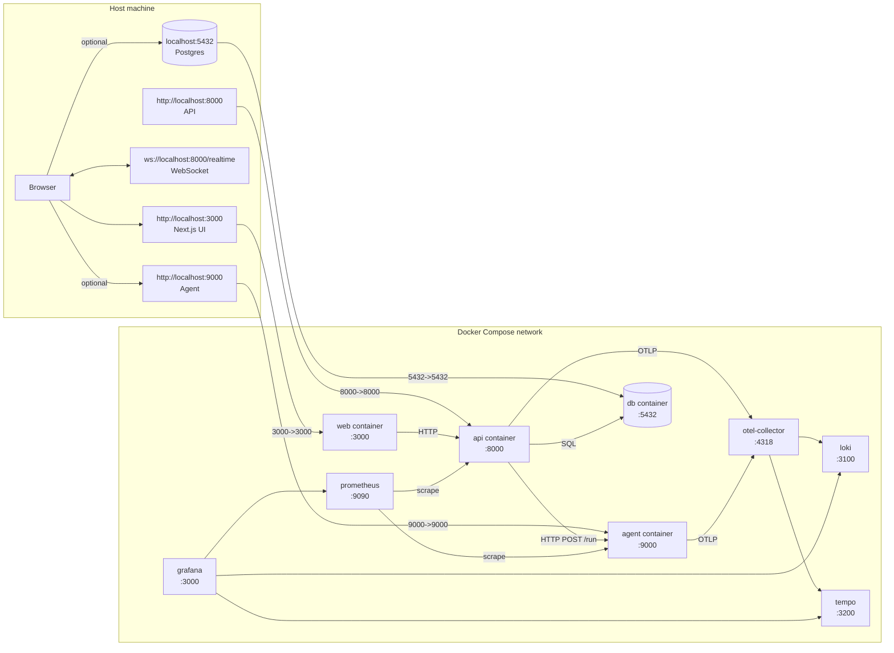
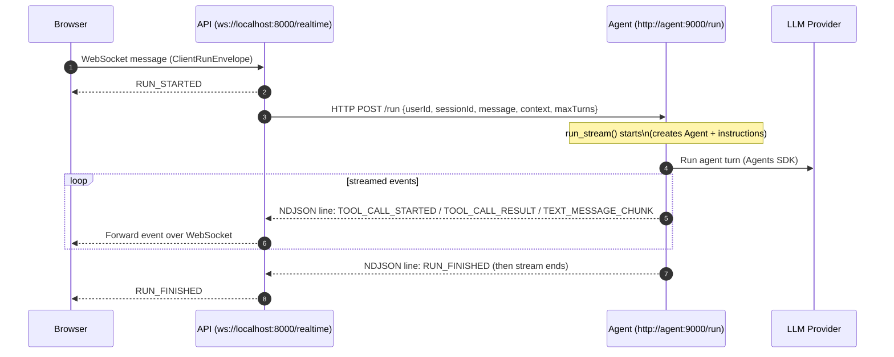
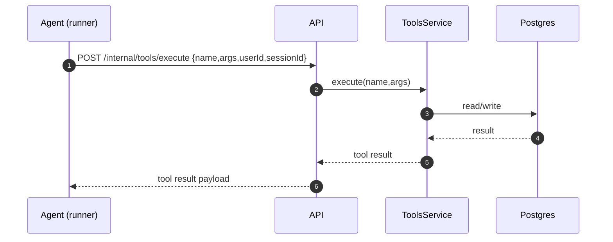
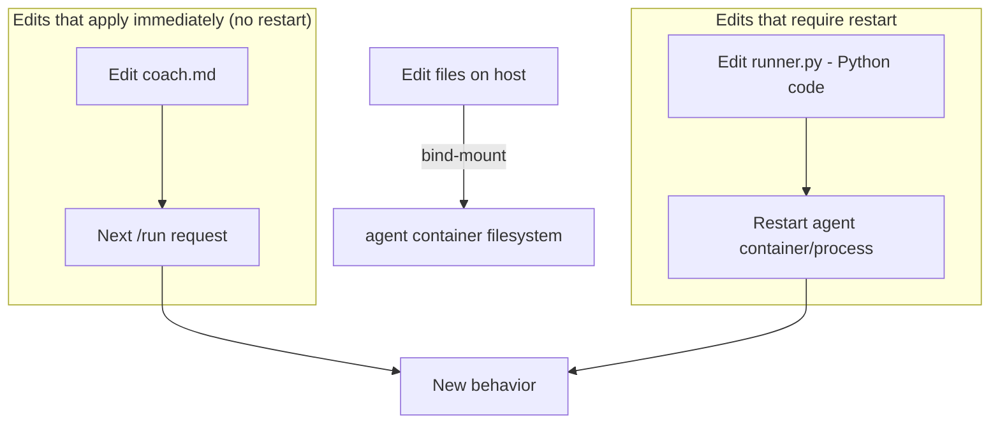

# trainer2 — Runtime & Message Flow (Visual)

This document shows what’s running where, and what happens when you send a chat message.

---

## 1) What’s running where (Host ↔ Docker)



Notes:
- The browser talks to the **API** over WebSocket (`/realtime`).
- The API talks to the **agent** over HTTP (`POST /run`).
- The DB is published to your host, so tools like DBeaver can connect to `localhost:5432`.

---

## 2) The “send message” flow (Browser → API WS → Agent /run → streamed events)



What this buys you:
- The UI can show progress (tool started / finished) without waiting for the whole response.

---

## 3) Inside the agent “runner” turn

High-level idea: the agent process constructs an agent + instructions, runs the Agents SDK, and emits events.

```mermaid
flowchart TD
  A[POST /run] --> B[run_stream(...)]
  B --> C[compile_coach_instructions()] 
  C --> C1[Load coach.md]
  C --> C2[Load tool schemas from generated/ (capabilities)]
  C --> C3[Load table cards from generated/]

  B --> D[Create Agent(...)]
  D --> E[Runner.run_streamed(...)]
  E --> F{SDK emits event}

  F -->|tool_called| G[Emit TOOL_CALL_STARTED]
  F -->|tool_output| H[Emit TOOL_CALL_RESULT]
  F -->|final text| I[Emit TEXT_MESSAGE_CHUNK]
  E --> J[Emit RUN_FINISHED]
```

Important practical detail:
- Prompt/instructions markdown is read from disk each run. With a bind-mount, prompt edits take effect on the next message.
- Python code changes (e.g., changing tool registration) generally require restarting the agent container/process.

---

## 4) Tool execution (Agent → API internal tool endpoint → DB)

Even though the model “decides” tool calls, the **API** is the side-effect executor.



---

## 5) Capabilities sync (API publishes tool schemas; agent caches to generated/)

The agent can fetch `/capabilities` (JWT-authenticated) and write the results to `services/agent/app/generated/`.

```mermaid
flowchart LR
  API[API /capabilities] -->|HTTP GET + agent JWT| Agent[agent /update or startup]
  Agent -->|write files| Gen[services/agent/app/generated/index.json + tools/*.json + table_cards/*.md]
  Gen --> Runner[compile_coach_instructions()]
  Runner --> Reads[reads generated/ index + tool schemas + table cards]
```

---

## 6) Fast iteration workflow (dev bind-mount)

With the dev override, your host code is mounted into the running agent container.



---

## 8) Proposed “mini renderer” (A2UI-style subset)

Goal: keep the current transport exactly the same (Agent streams events → API forwards to browser), but add one new *renderable* event type that the web app can interpret.

### 8.1 Message shapes (conceptual)

- Agent emits (streamed NDJSON line):
  - `type: a2ui.render`
  - `payload: { view: ..., state: ..., version: ... }`

- Browser sends user interactions back over WS as:
  - `type: a2ui.action`
  - `payload: { action: ..., args: ..., viewVersion: ... }`

The API treats `a2ui.action` the same way as chat: it calls the agent again (`POST /run`) with an “action message” in the user message field (or a dedicated field later), so the agent can respond with an updated `a2ui.render`.

### 8.2 “Mini” component set (start small)

Implement only 3–5 primitives in the React app:
- `Text`
- `Button`
- `Input`
- `Column` (vertical stack)
- `Row` (horizontal stack)

That’s enough to render onboarding forms, quick toggles, and “confirm/continue” flows.

### 8.3 Where code changes would land

- Agent (event emission): extend the `/run` stream to include `a2ui.render` events.
  - Likely file: `services/agent/app/runner.py`
  - Approach: have the model output a fenced JSON block (e.g. ```a2ui) and parse it server-side into a structured event.

- API (WS forwarding): treat `a2ui.render` as just another event type and forward it to the browser.
  - Likely files: `services/api/app/routes/realtime.py` and/or the event envelope types used there.

- Web (renderer): add a tiny renderer that maps `payload.view` nodes to React components.
  - Likely files: `apps/web/app/coach/useCoachChat.ts` (event handling) + a new renderer module under `apps/web/app/coach/`.

---

## 9) Prompt changes to enable the mini renderer

The prompt should explicitly separate:
- “normal chat response” (plain text)
- “UI response” (A2UI JSON)

Suggested changes (high level):
- Update `services/agent/app/instructions/agents/coach.md` to:
  - Encourage emitting a fenced `a2ui` JSON block when UI would help.
  - Forbid non-deterministic UI side effects (keep it as render specs + actions only).
  - When receiving an `a2ui.action`, treat it as the user’s next turn and respond with updated UI and/or text.

Minimal convention (example):
- When returning UI:
  - Include one code block: ```a2ui { ... } ```
- When receiving action:
  - The user message will start with `A2UI_ACTION:` followed by JSON.

---

## 7) The one endpoint to remember

- Browser connects to: `ws://localhost:8000/realtime` (API)
- API calls agent at: `POST http://agent:9000/run` (inside Docker)
- Host access for agent (debug): `http://localhost:9000/run`
